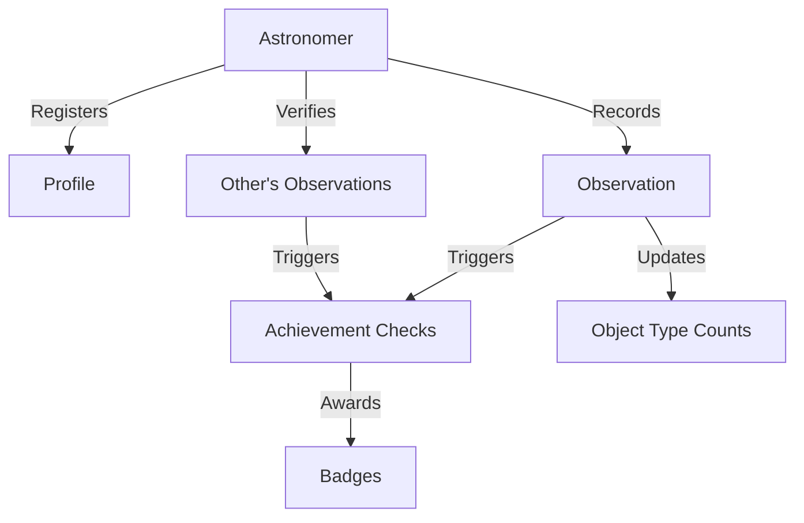

# Celestial Observer's Registry

A decentralized astronomical observation registry built on the Stacks blockchain that enables amateur astronomers to permanently record and verify celestial observations while earning achievement badges for their discoveries.

## Overview

The Celestial Observer's Registry serves as a digital logbook for amateur astronomers to:
- Record detailed observations of celestial objects
- Verify observations made by other astronomers
- Earn achievement badges for astronomical milestones
- Build a permanent, tamper-proof record of astronomical discoveries

The system creates a trustworthy, community-validated archive of astronomical observations while gamifying the process of astronomical discovery through achievement badges.

## Architecture

The registry is built around a main smart contract (`star-vault.clar`) that manages:
- Astronomer registration and profiles
- Observation recording and verification
- Achievement badge system
- Object type tracking for achievements



## Contract Documentation

### Star Vault Contract

The main contract managing all registry functionality.

#### Key Components:

1. **Astronomers Registry**
   - Stores user profiles
   - Tracks observation and verification counts
   - Manages registration status

2. **Observation System**
   - Records detailed astronomical observations
   - Includes coordinates, conditions, equipment used
   - Supports evidence hashes for verification

3. **Badge System**
   - Predefined achievement badges
   - Automatic achievement tracking
   - Badge awarding logic

4. **Verification Mechanism**
   - Community-based observation verification
   - Prevents self-verification
   - Tracks verification counts

## Getting Started

### Prerequisites
- Clarinet
- Stacks wallet
- Basic understanding of astronomical coordinates

### Installation
1. Clone the repository
2. Install dependencies with Clarinet
3. Deploy the contract
4. Initialize the badge system using `initialize-badges`

### Basic Usage

1. Register as an astronomer:
```clarity
(contract-call? .star-vault register-astronomer "AstroJohn")
```

2. Record an observation:
```clarity
(contract-call? .star-vault record-observation 
    "M31" 
    "Galaxy" 
    "00h 42m 44.3s" 
    "+41° 16' 9"" 
    "Dark Sky Site" 
    "Good" 
    "Clear" 
    "8-inch Dobsonian" 
    "Spiral arms visible" 
    none)
```

3. Verify an observation:
```clarity
(contract-call? .star-vault verify-observation u1)
```

## Function Reference

### Public Functions

#### `register-astronomer`
```clarity
(define-public (register-astronomer (username (string-utf8 50))))
```
Registers a new astronomer in the system.

#### `record-observation`
```clarity
(define-public (record-observation 
    (celestial-object (string-utf8 100))
    (object-type (string-utf8 50))
    (right-ascension (string-utf8 20))
    (declination (string-utf8 20))
    (location (string-utf8 100))
    (seeing (string-utf8 50))
    (weather (string-utf8 100))
    (equipment (string-utf8 200))
    (notes (string-utf8 500))
    (evidence-hash (optional (buff 32)))))
```
Records a new astronomical observation.

#### `verify-observation`
```clarity
(define-public (verify-observation (observation-id uint)))
```
Verifies another astronomer's observation.

### Read-Only Functions

- `get-astronomer`: Retrieves astronomer profile
- `get-observation`: Retrieves observation details
- `get-badge`: Retrieves badge details
- `get-astronomer-badge`: Checks if astronomer has specific badge
- `get-object-type-count`: Gets count of specific object types observed

## Development

### Testing

Run tests using Clarinet:
```bash
clarinet test
```

### Local Development
1. Start Clarinet console:
```bash
clarinet console
```
2. Deploy contract
3. Initialize badges
4. Test functionality with provided functions

## Security Considerations

### Limitations
- Verification system relies on community trust
- Evidence hashes should be properly generated off-chain
- Badge criteria are simplified for demonstration

### Best Practices
- Always verify transaction success
- Don't share private keys
- Validate all input parameters
- Wait for transaction confirmation before updating UI
- Implement proper authorization for admin functions in production

# shivanirajput2597/Stack
# README.md
### Stack Blockchain

### Description
The Stackcoin Contract is deployed on the stacks blockchain which is use for creating fungible tokens .
Here we have fungible and non-fungible token for future transactions for different contracts according to the requirement 
we have defined in this repository.

The Stacks blockchain provides a novel consensus mechanism called proof of transfer (PoX), which uniquely connects Stacks to Bitcoin security and enables cross-chain interactions.

### Features 

##### [A] Transaction Types
- Stack transfer transaction
- Contract deployment transaction
- Contract execution transaction 

##### [B] Token Standard
- Fungible token (FT)
- Non-fungible token (NFT)


### Technologies

- [x] Clarity
- [x] Stack API
- [x] Visual Studio Code


### Prerequisites
- Node.js 14+ environment
- Clarinet 
- Stack API
- Visual Studio Code

### Setup
````
npx @stacks/cli run new
````

### Unit test cases for the coin contract 

```
#[test]
fn test_coinbase() {
  let result = run("coinbase", &vec![]);
  assert_eq!(result, Ok(Value::Uint(100)));
}

#[test]
fn test_transfer() {
  let result = run("transfer", &vec!["0x123", "10"]);
  assert_eq!(result, Ok(Value::Bool(true)));
}

#[test]
fn test_balanceOf() {
  let result = run("balanceOf", &vec!["0x123"]);
  assert_eq!(result, Ok(Value::Uint(0)));
}

#[test]
fn test_name() {
  let result = run("name", &vec![]);
  assert_eq!(result, Ok(Value::Str("Stackcoin".into())));
}

#[test]
fn test_symbol() {
  let result = run("symbol", &vec![]);
  assert_eq!(result, Ok(Value::Str("STX".into())));
}

#[test] 
fn test_totalSupply() {
  let result = run("totalSupply", &vec![]);
  assert_eq!(result, Ok(Value::Uint(1000000)));
}
```

### Running the tests 

```
cargo test
```

### Deploy steps

1. Build the clarity contract
```
clarinet build coin
```

2. Deploy the contract 
```
clarinet deploy coin.clar
```

3. Test transactions
```
clarinet transfer 0x123 10 
```

### Architecture 

```
src/
  coin.clar    # Main Clarity contract 
  functions.ts # Helper functions
  types.ts     # Type definitions
tests/  
  coin.test.ts # Unit test cases
README.md      # Project documentation
```

### Contract Interface

The contract exposes the following public functions:

```clarity
;; Token Interface
(define-public (transfer (to principal) (amount uint))) 
(define-public (balanceOf (account principal)))
(define-read-only (name))
(define-read-only (symbol)) 
(define-read-only (totalSupply))

;; Minting function
(define-private (coinbase)) 
```

### FUTURE 
- Add staking functionality
- Support more token standards
- Implement governance features
- Add liquidity provision
- Cross-chain bridges

### AUTHOR
```
Name :- Shivani Rajput 
```

### LICENSE 
This project is licensed under the MIT License.


# shivanirajput2597/Stack
# coin.clar
;; coin contract
(define-fungible-token coin)

;; Constants 
(define-constant err-insufficient-funds u2)

(define-constant initial-supply u1000000)

(define-data-var total-supply uint initial-supply)

;; Get token name
(define-read-only (name)
  (ok "Stackcoin")
)

;; Get token symbol  
(define-read-only (symbol)
  (ok "STX")
)

;; Get total supply
(define-read-only (totalSupply)
  (ok (var-get total-supply))
)

;; Get balance for address
(define-read-only (balanceOf (address principal))
  (ok (ft-get-balance coin address))
)

;; Transfer tokens
(define-public (transfer (to principal) (amount uint))
  (begin 
    (asserts! (>= (ft-get-balance coin tx-sender) amount) 
      (err err-insufficient-funds))
      
    (try! (ft-transfer? coin amount tx-sender to))
    (ok true))
)

;; Mint initial supply 
(define-private (coinbase)
  (ft-mint? coin u100 tx-sender)
)

;; Initialize
(begin
  (try! (coinbase))
  (print "Contract initialized"))

# shivanirajput2597/Stack
# types.ts
// Types for contract state
export interface ContractState {
  totalSupply: number;
  balances: Map<string, number>;
}

// Transaction type for moving coins 
export interface Transfer {
  from: string; 
  to: string;
  amount: number;
}

// Result type for function responses
export type Result<T> = {
  success: true;  
  value: T;
} | {
  success: false;
  error: string;
}

export interface TokenInfo {
  name: string;
  symbol: string;
  decimals: number;
}

export type Address = string;
export type Amount = number;

# functions.ts
import { ContractState, Transfer, Result } from './types';

// Helper function to validate transfer
export function validateTransfer(
  state: ContractState, 
  transfer: Transfer
): Result<void> {
  const balance = state.balances.get(transfer.from) || 0;
  
  if (balance < transfer.amount) {
    return {
      success: false,
      error: 'Insufficient funds'
    };
  }

  return {
    success: true,
    value: undefined
  };
}

// Update balances after transfer
export function updateBalances(
  state: ContractState,
  transfer: Transfer
): ContractState {
  const fromBalance = state.balances.get(transfer.from) || 0;
  const toBalance = state.balances.get(transfer.to) || 0;

  state.balances.set(transfer.from, fromBalance - transfer.amount);
  state.balances.set(transfer.to, toBalance + transfer.amount);

  return state;
}

// Mint new coins
export function mint(
  state: ContractState,
  address: string,
  amount: number 
): ContractState {
  const balance = state.balances.get(address) || 0;
  state.balances.set(address, balance + amount);
  state.totalSupply += amount;
  return state;
}

// Get balance for address
export function getBalance(
  state: ContractState,
  address: string
): number {
  return state.balances.get(address) || 0;
}

// Burn coins
export function burn(
  state: ContractState,
  address: string,
  amount: number
): Result<ContractState> {
  const balance = state.balances.get(address) || 0;
  
  if (balance < amount) {
    return {
      success: false,
      error: 'Insufficient balance to burn'
    };
  }

  state.balances.set(address, balance - amount);
  state.totalSupply -= amount;

  return {
    success: true, 
    value: state
  };
}
# README.md
# Meme-Generator


Welcome to Meme Generator! This application lets you create custom memes by adding text captions to popular meme images.

## Features

- Choose from a selection of popular meme images
- Add top and bottom text to your meme
- Customize the text styling
- Download your meme image

## Technologies Used

- React.js
- CSS
- React Icons
- HTML 5 Canvas

## Live Demo

Check out the live demo at: [Meme Generator](https://shhivam-yt-meme-generator.netlify.app/)
End File# public/index.html
<!DOCTYPE html>
<html lang="en">
  <head>
    <meta charset="utf-8" />
    <meta name="viewport" content="width=device-width, initial-scale=1" />
    <meta name="theme-color" content="#000000" />
    <meta
      name="description"
      content="Web site created using create-react-app"
    />
    <title>Meme-Generator</title>
  </head>
  <body>
    <noscript>You need to enable JavaScript to run this app.</noscript>
    <div id="root"></div>
    <script src="https://kit.fontawesome.com/8b5f5ff0da.js" crossorigin="anonymous"></script>
  </body>
</html>
End File# Shhivam-Agarwal/Meme-Generator
import React from "react";
import "./App.css";
import { Header } from "./components/Header";
import { Main } from "./components/Main";
import "./index.css";

function App() {
  return (
      <div>
      <Header/>
      <Main/>
    </div>
  );
}

export default App;
End File# Shhivam-Agarwal/Meme-Generator
// import React from "react";
// import memesData from "../memesData";

// function Meme() {
//   function getMemeImage() {
//     const memesArray = memesData.data.memes;
//     const random = Math.floor(Math.random() * memesArray.length);
//     const url = memesArray[random].url;
//     console.log(url);
//   }
//   return (
//     <div>
//       <button onClick={getMemeImage} className="meme">
//         Hi,Click me
//       </button>
//     </div>
//   );
// }

// export default Meme;

import React, { useState, createRef } from "react";
import { exportComponentAsJPEG } from "react-component-export-image";
import "../StyleSheet/Meme.css";

function Meme() {
  const [meme, setMeme] = useState({
    topText: "",
    bottomText: "",
    randomImage: "./logo192.png",
  });

  const getMemeImage = () => {
    const randomNumbers = Math.floor(Math.random() * allMemes.length);
    setMeme((prevMeme) => ({
      ...prevMeme,
      randomImage: allMemes[randomNumbers].url,
    }));
  };

  const handleChange = (event) => {
    const { name, value } = event.target;
    setMeme((prevMeme) => ({
      ...prevMeme,
      [name]: value,
    }));
  };

  const [allMemes, setAllMemes] = React.useState([]);

  const memeRef = createRef();

  React.useEffect(() => {
    fetch("https://api.